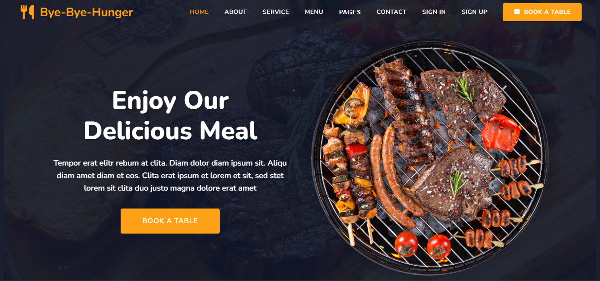
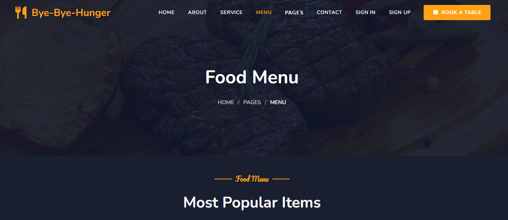
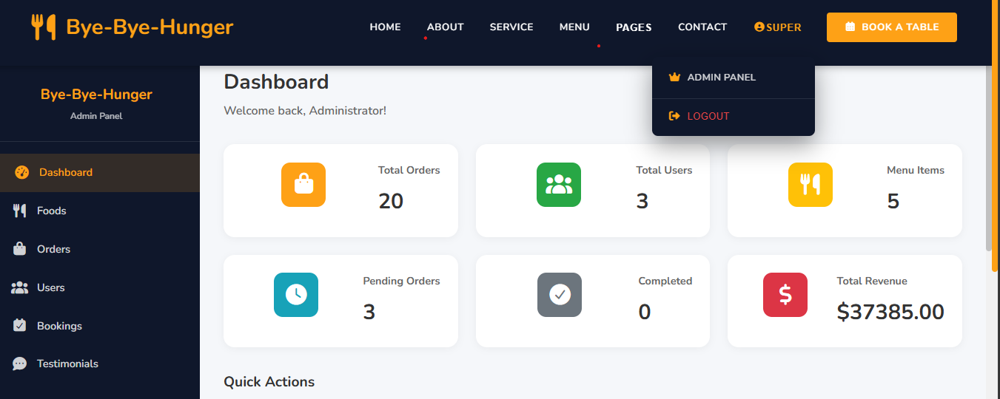
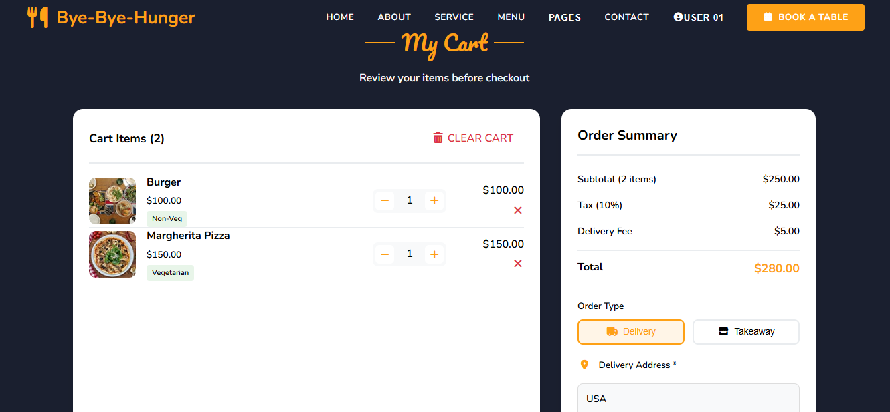

---

# Demo

# 📷 Screenshots

### 🏠 Home Page

### 🍽 Menu Page

### 🛠 Admin Dashboard

### 🛒 Cart Page

---

# 🔐 Security Features

- JWT Authentication
- Password Hashing with bcrypt
- Role-Based Access Control
- Environment Variables Protection
- Email Verification System

---

# 📈 Future Improvements

- Stripe Payment Gateway Integration
- Google / Facebook Login
- Real-time Order Tracking (Socket.io)
- Push Notifications
- Coupon & Discount System

---

# 👨‍💻 Author

**Qazafi Hussain**

Full Stack Developer  
React | Node.js | MongoDB | Machine Learning

GitHub: https://github.com/Qazafi-Hussain-Developer

---

⭐ If you like this project, consider giving it a star!
